## Customer-Churn-Prediction
## by Oluseye Oyeniran
---

***

## Introduction
_ _ _

In this comprehensive project, we adopt an all-inclusive approach to predict customer churn by identifying specific criteria that indicate the likelihood of customers discontinuing their services.

---

Customer churn, also referred to as customer attrition or customer defection, is a term used to describe the situation when customers terminate their association with a business or cease utilizing its products or services. It reflects the rate at which customers disengage or end their involvement with a company within a specific timeframe. The primary objective of this project was to predict potential churn customers using historical data provided by our client. It involved a classification problem that utilized a supervised machine learning approach. To begin the analysis, I formulated queries to join tables and extract the necessary data from the database. Through data exploration and transformation, and employing statistical techniques such as Variance Inflation Factor, Recursive Feature Elimination, and assessment of multicollinearity, I reduced the initial set of 158 derived features to the most crucial eight features. These selected features were utilized as the final set for prediction. The predictive model successfully identified over 4,000 potential churners, which has the potential to generate an additional annual revenue of over $2,000,000 for the business.

---
## Problem Statement
---

The main challenge addressed in this Python-based project is to accurately forecast potential customer churn utilizing historical data, as supplied by our client.

---
## Data Sourcing and Integration
---
The project's data is sourced from the Client Database, encompassing transactional, behavioral(acquired through RFM analysis), attitudinal, and demographic data. To extract the necessary information for analysis, tailored SQL queries were formulated. These queries efficiently gathered the diverse data components from the database.
Integration of the data was achieved by seamlessly linking the database with a Python Jupyter Notebook. This integration was enabled through the utilization of the Pandas library for data manipulation and the pyodbc library for connecting to the database. This streamlined process facilitated efficient data access and transformation, laying the foundation for subsequent analysis and insights.

Attiudinal Data       |  Demographic Data
:---------------:     |:----------------:
 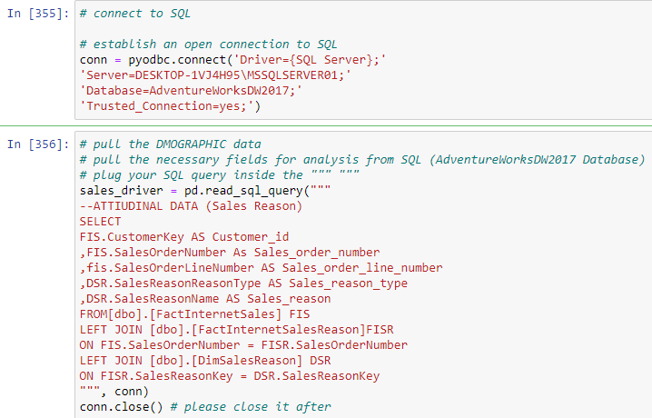 | 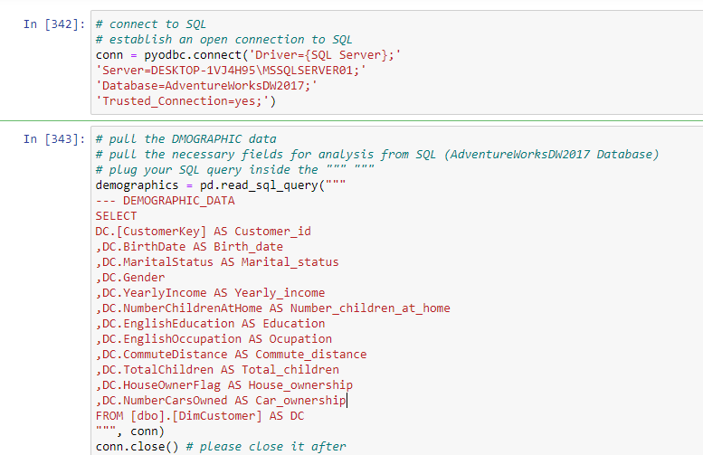  

Transactional Data       |  Behavioral Data
:---------------:     |:----------------:
 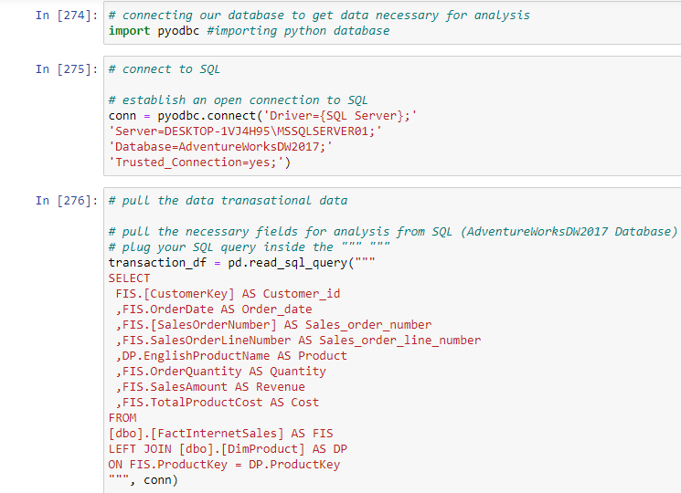 | 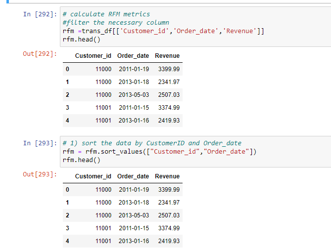 

---

## Skill Demostrated 🤓
---
For a detailed account of how these skills were effectively employed to arrive at the solution to the problem, please refer to the project documentation or report 

- Data Preprocessing: Cleaning, transforming, and preparing raw data for analysis, including handling missing values, outlier detection, and feature scaling.

- Feature Engineering: Creating relevant and informative features that capture customer behavior, demographics, and interactions.

- Exploratory Data Analysis (EDA): Analyzing data distributions, visualizing patterns, and identifying insights that guide feature selection and model creation.

- Machine Learning Algorithms: Implementing various classification algorithms such as Random Forest, Gradient Boosting, SVM, KNN, Logistic Regression, Naive Bayes, and Neural Networks to predict churn.

- Model Selection and Evaluation: Comparing multiple models, tuning hyperparameters, and evaluating their performance using metrics like accuracy, precision, recall, F1-score

- Feature Importance Analysis: Determining the significance of features in predicting churn using techniques like recursive feature elimination, feature importance scores from tree-based models, and VIF analysis.

- Customer Profiling and Segmentation: Utilizing clustering techniques ( K-means) to group customers based on behavior, enabling targeted strategies for retention.
  
- Data Integrity and Validation: Ensuring data quality, consistency, and accuracy through single customer view creation, duplication handling, and validation against real-world scenarios.

- Model Deployment: Scoring models on unseen data, validating real-world performance, and preparing for integration into production systems.

- Commercial Impact Assessment: Evaluating the business implications of churn prediction, including revenue preservation, cost savings, enhanced customer loyalty, and data-driven decision-making.

- Communication Skills: Presenting findings, insights, and recommendations to stakeholders in a clear and concise manner, bridging the gap between technical and non-technical audiences.

- Problem Solving and Critical Thinking: Identifying challenges, choosing appropriate techniques, and iterating on solutions to improve model performance and address real-world business concerns.

- Project Management: Planning, organizing, and executing a comprehensive churn prediction project, including data collection, analysis, modeling, and deployment phases.

---

## Methodology

---

The approach employed to address the problem encompassed several key steps, demonstrating a comprehensive methodology for churn prediction:
- Churn Definition: Churn was meticulously defined as the absence of any customer purchase within the last 8 months of business transactions, specifically, when the maximum or last transaction date is before October 31, 2007.

- Exploratory Analysis: An exploratory analysis was undertaken to gain insights into the characteristics of churners. This analysis involved delving into demographic, transactional, and attitudinal data. A decision tree was utilized to establish a rule set for describing these customers, and distribution plots were created to visualize demographic variables against the churn target.

- Feature Engineering with RFM: The feature engineering phase incorporated the Recency-Frequency-Monetary (RFM) analysis. This analysis facilitated the creation of attributes such as recency, frequency, and lifetime value for each customer. Subsequently, RFM variables or RFM Scores were employed to construct a clustering model using the K-means algorithm, an unsupervised technique. The optimal number of clusters was determined using the elbow method. The resulting cluster assignments were integrated into the modeling and scoring variables, with the churn variable as the target.

- Data Refinement and Integrity: To ensure data integrity, a single customer view was established, meaning that the final dataset featured a single customer's data per row, eliminating duplicates.

- Modeling Phases: The modeling phases encompassed a comprehensive series of steps, beginning with statistical testing to assess multi-collinearity and overfitting. Distributions were investigated, and any outliers, extreme values, or spurious entries were identified. Missing values were imputed where applicable. Feature selection was conducted to streamline the variables. Data was partitioned into training, testing, or validation sets, or cross-validation techniques were employed. Multiple models were developed, compared, and evaluated, culminating in the selection of the most promising model.

- Model Deployment and Validation: The selected champion model was deployed or scored on an unseen dataset, which had not been part of the model development phase. This procedure ensured that the model's performance was assessed in a real-world context, devoid of any potential bias introduced during training.

- Revalidation and Finalization: Prior to launching the primary marketing campaign, a final revalidation of the model was conducted. This step guaranteed that the model's effectiveness and reliability were verified, setting the stage for a successful campaign rollout.

---

## Exploratory Data Analysis (EDA) 
----
EDA involved comprehensive data exploration to uncover insights and patterns, aiding our understanding of the dataset's characteristics and relationships.

Education             |  Age distribution
:---------------:     |:----------------:
 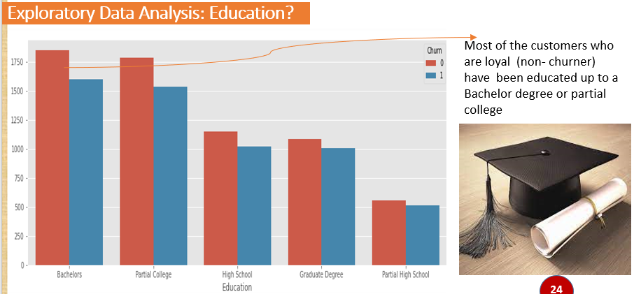 | 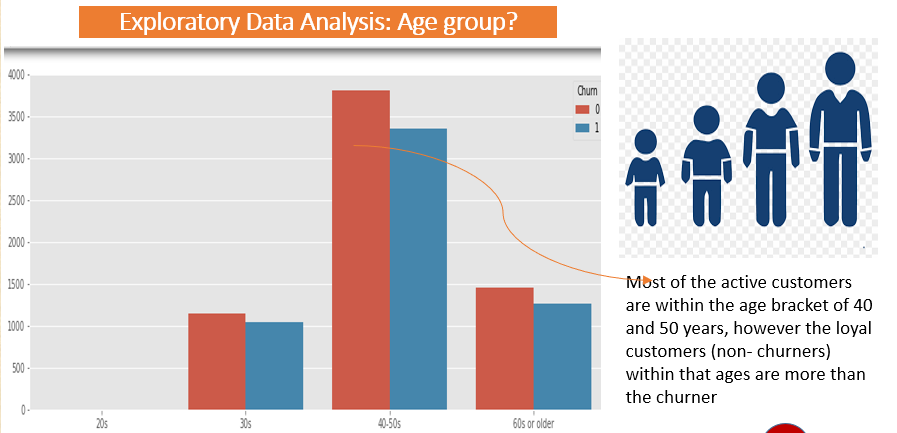  

 Commute              |  Income
:---------------:     |:----------------:
 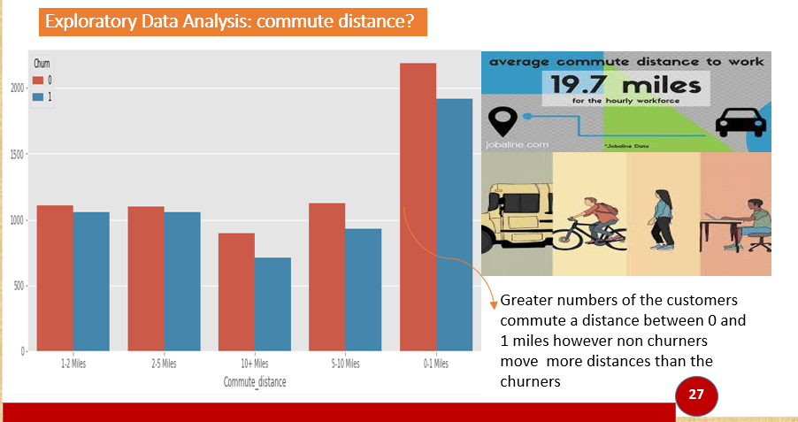 | 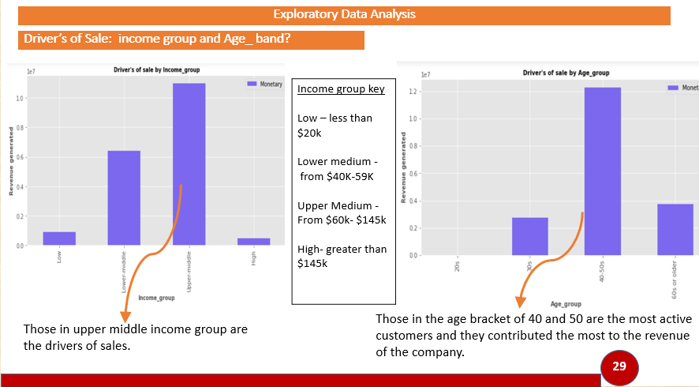  

Occupation            |  Ownership
:---------------:     |:----------------:
 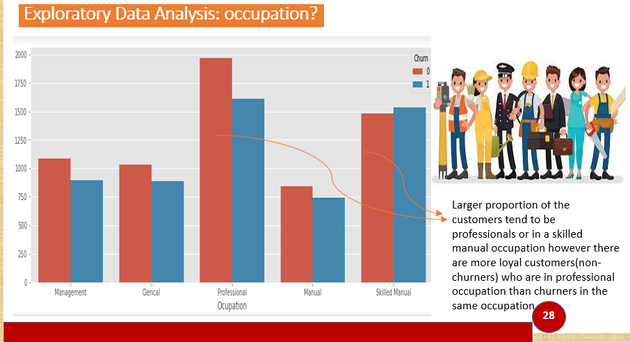 | 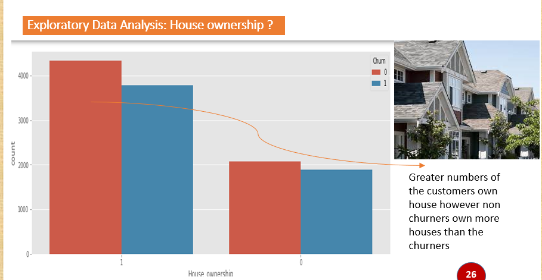  

---

## Feature Engineering. 
---
We employed a voting-based approach to select impactful features for prediction. Techniques like information value, weight of evidence, random forest, extra trees, chi-square, and L1 were used to reduce 139 features to 10. Further pruning, guided by variance inflation factor (VIF), led to the final 7 most important features.

---

                                      
   Feature selection  |  Final Feature
:---------------:     |:----------------:
 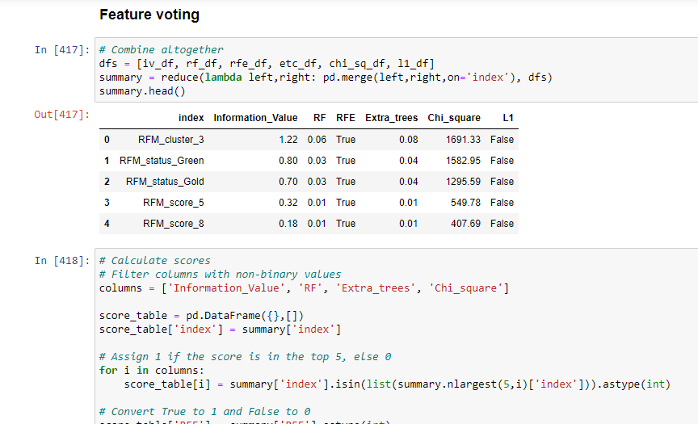 | 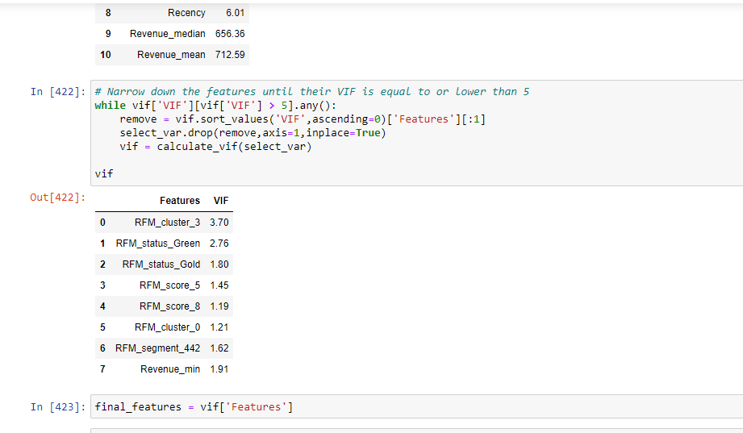 

## Model Selection
----
We conducted a parallel model run on our final features, evaluating 10 classification models including Random Forest, Extra Tree, Gradient Boosting, SVM, KNN, Logistic Regression, LDA, Naive Bayes, and Neural Network. Gradient Boosting emerged as the winning model due to its highest f-beta score on the test data.

---

   model Trained  |  model Trained
:---------------: |:----------------:
 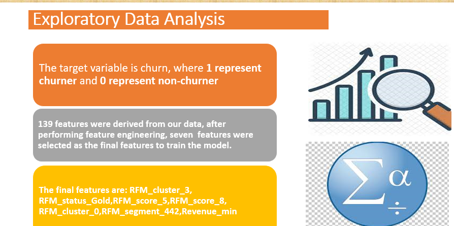 | 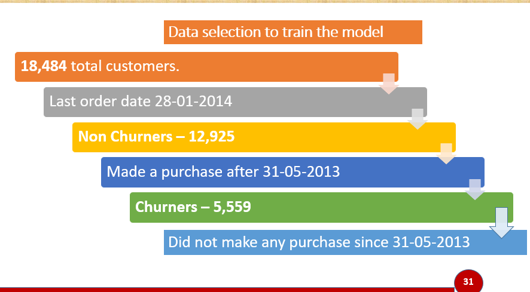 

  Modele Trained  |  Champion Model
:---------------:     |:----------------:
 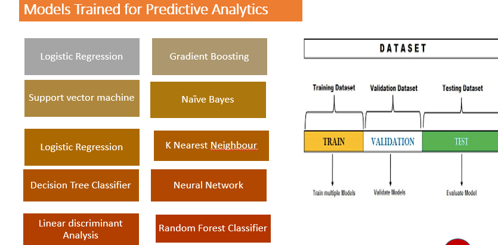 | 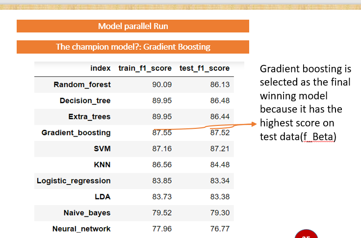 

---

## model Evaluation

Model Evaluation: Assessing Performance and Validating Results
In the context of our project, model evaluation was a critical phase to gauge the effectiveness and reliability of our churn prediction models. This phase involved a series of steps to measure the models' performance, ensuring that they can make accurate predictions on new, unseen data. Here's how we approached model evaluation:

- 	Data Splitting: We partitioned our dataset into training and testing subsets 80/20. The training data was used to train the models, while the testing data allowed us to assess their performance on unseen samples.

- 	Metrics Selection: We selected appropriate evaluation metrics based on the nature of the churn prediction problem. Commonly used metrics included accuracy, precision, recall, F1-score and confusion matrix

- Cross-Validation: For a robust assessment, we employed techniques like k-fold cross-validation. This involved splitting the training data into multiple folds, training the model on different subsets, and evaluating it on the remaining fold. This helped ensure that our evaluation results were not biased by a specific data split.

- Hyperparameter Tuning: We fine-tuned the models' hyperparameters to optimize their performance. Grid search was applied to explore different parameter combinations and find the best settings.

- Model Comparison: We compared the performance of multiple models using the selected metrics. This allowed us to identify the model that best suited the churn prediction problem based on its ability to balance precision and recall or other relevant criteria.

- 	Validation on Unseen Data: After selecting the best model based on cross-validation results, we validated its performance on the designated testing subset that the model had not seen during training. This step aimed to provide a realistic estimation of its performance in a real-world scenario.

- Business Impact Assessment: In addition to traditional metrics, we assessed the commercial impact of the model's predictions. This involved estimating potential revenue preservation, cost savings, and other business benefits based on model performance.

